# 인스타그램 클론코딩

인스타그램 클론코딩
<br>
<br>

### 팀 노션
https://www.notion.so/SA-1-abee07a086044fbbb5aa815b3cce5b79

<br>

### ⏳ 프로젝트 기간
2022.08.18 ~ 2022.08.25

<br>

### 🧑🏻👩🏻 팀원
Frontend(React)

김자성 - 회원가입, 로그인, 프로필 수정<br>
우수진 - 마이페이지<br>
배아랑이 - 메인화면, 상세화면<br>

<br>

Backend (Spring)

심규현 - 좋아요, 팔로우, 유저 게시글 조회<br>
김현서 - 프로필, 댓글 CRUD<br>
김보슬 - 로그인, 회원가입, 글 CRUD<br>

<br>

### ⚙ 기술 스택

Frontend


Backend


<br>

#### 개발도구

Frontend


Backend


<br>

### 🛠 구현 기능

1. 로그인, 회원가입

- JWT 인증 방식을 사용한 로그인, 로그아웃

2. 글 CRUD

- 글 조회, 작성, 수정, 삭제
- 다중 이미지 업로드

3. 댓글 CRUD

- 댓글 조회, 작성, 삭제

4. 좋아요

- 글에 좋아요, 좋아요 취소

5. 팔로잉

- 메인화면, 마이페이지에서 팔로잉, 언팔로잉 

<br>

### 🎨 구현 화면

1. 회원가입 화면<br>

<br>

2. 로그인 화면<br>

<br>

3. 메인 화면<br>
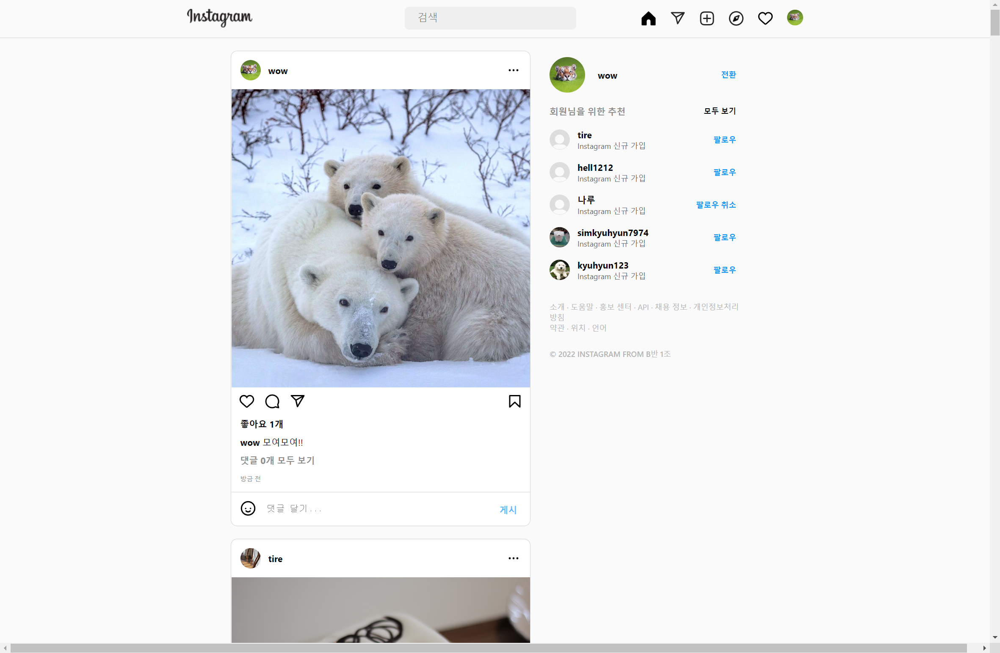
<br>

4. 글 상세 화면<br>
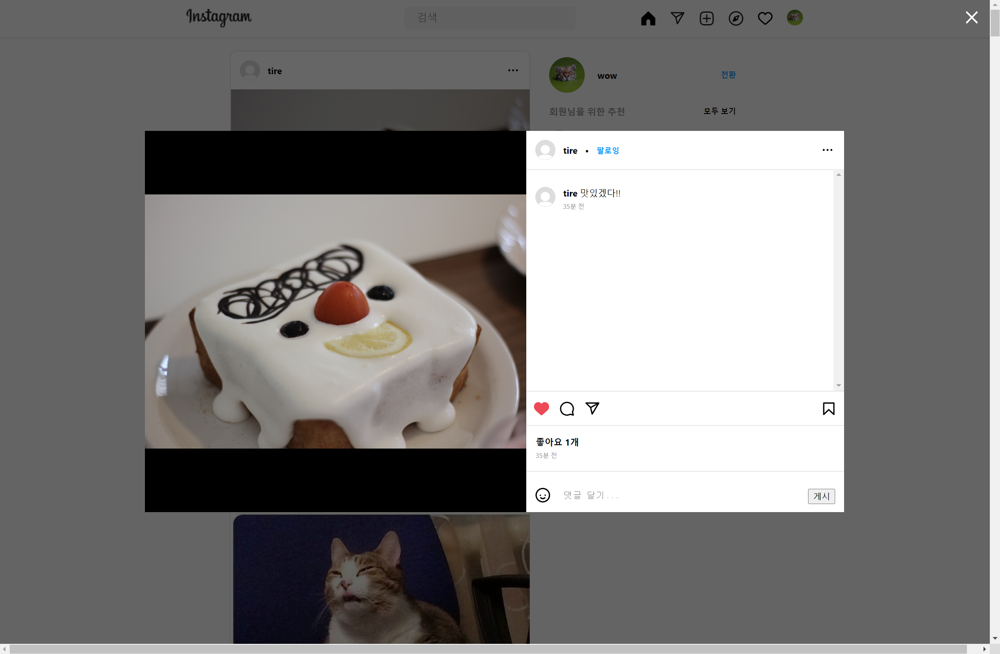
<br>

5. 글 작성 사진 선택 화면<br>
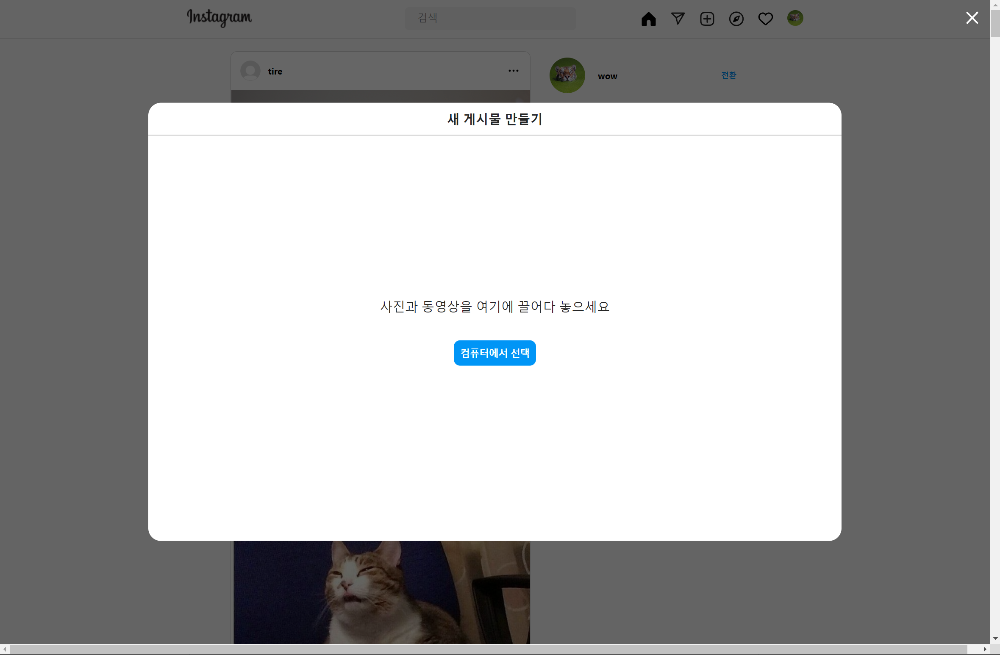
<br>

6. 글 작성 화면<br>
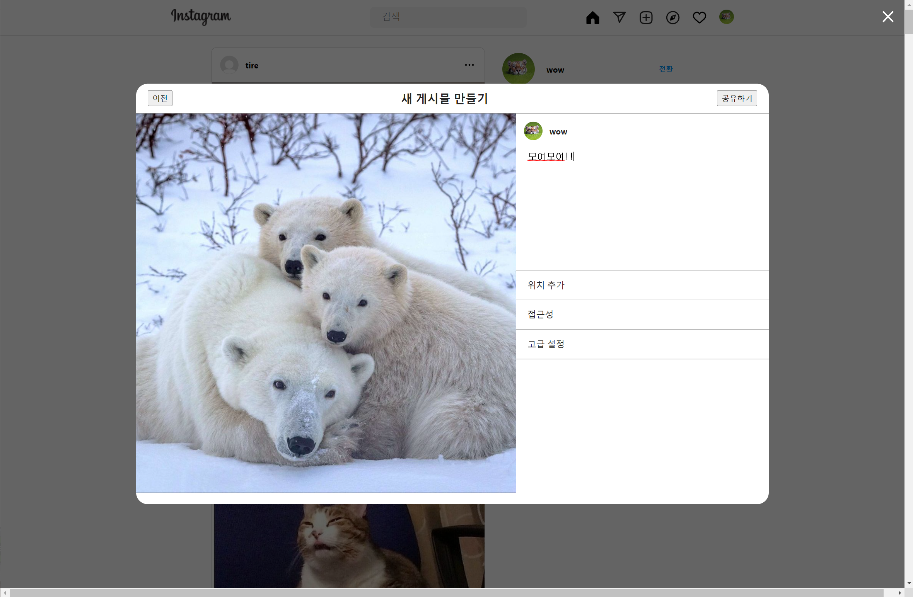
<br>

7. 마이페이지 화면<br>
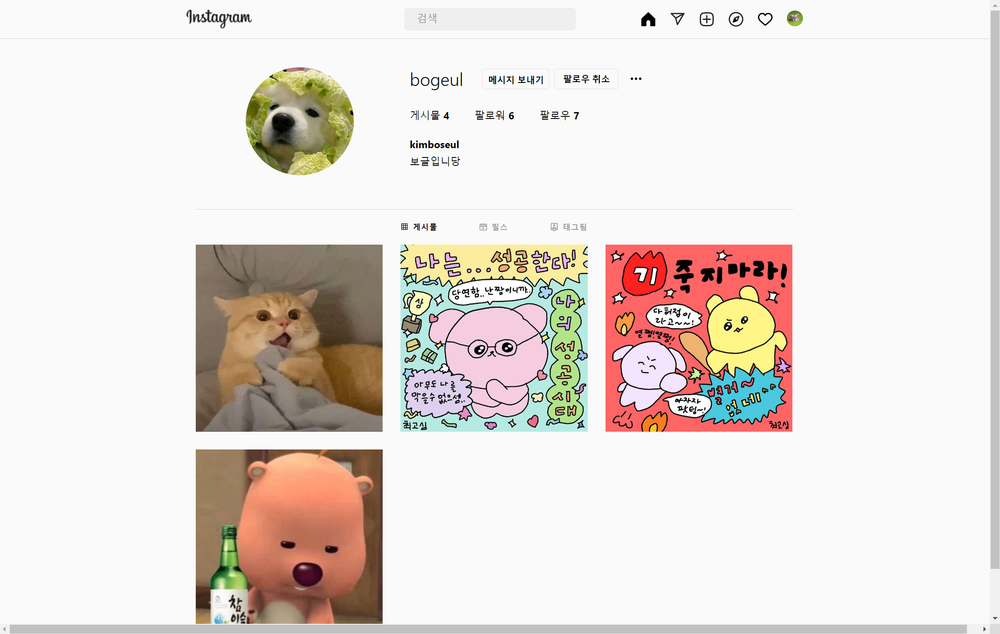
<br>

8. 프로필 편집 화면<br>
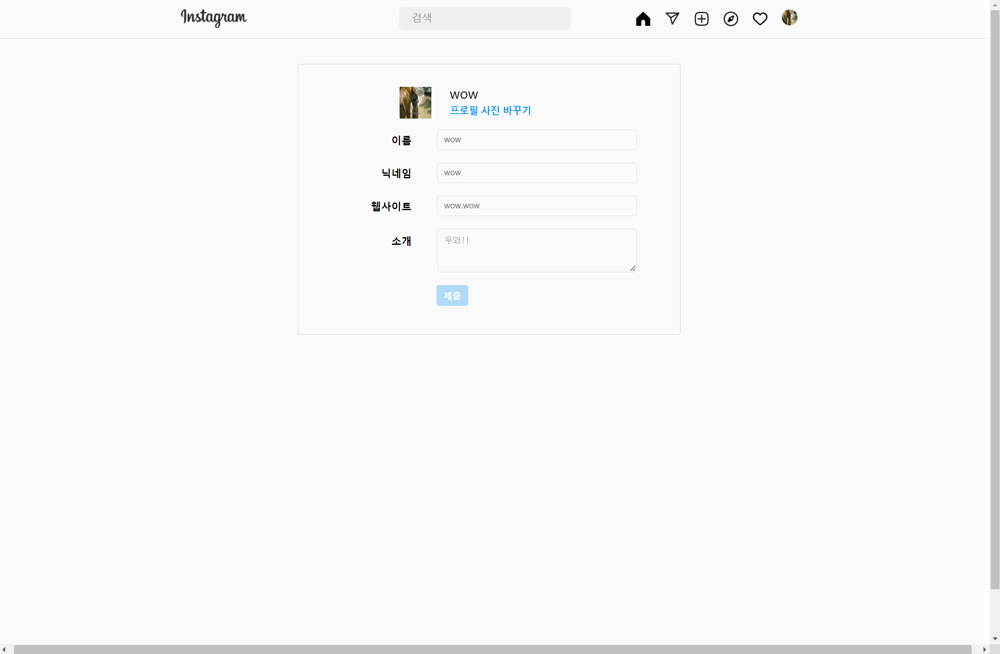
<br>


<br>

### 📃 API 명세서

<details>
<summary>API 명세서 보기</summary>
<div markdown="1">
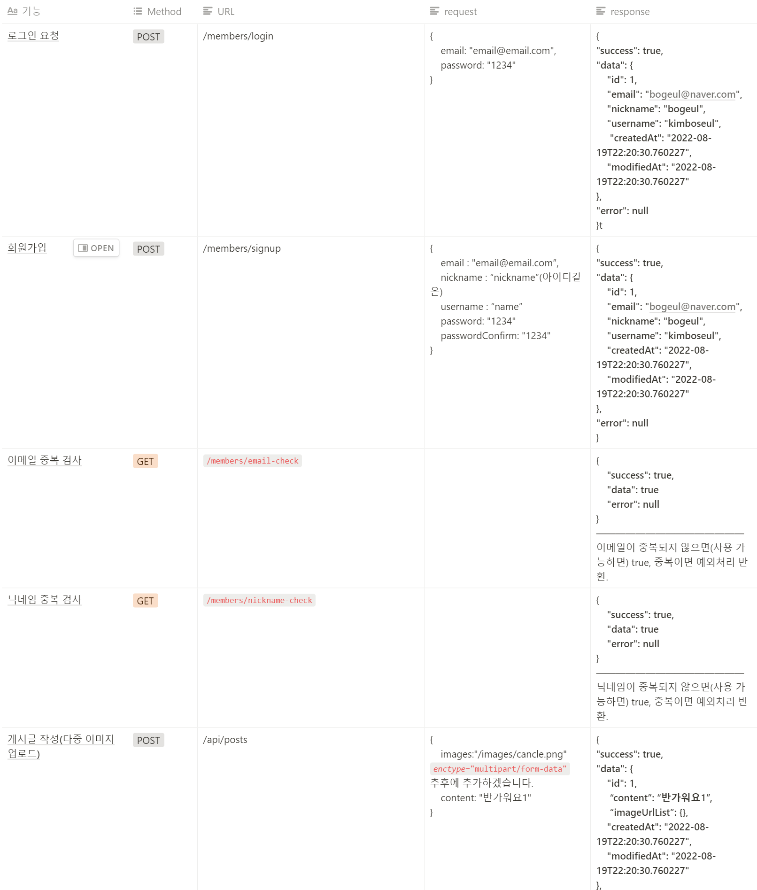
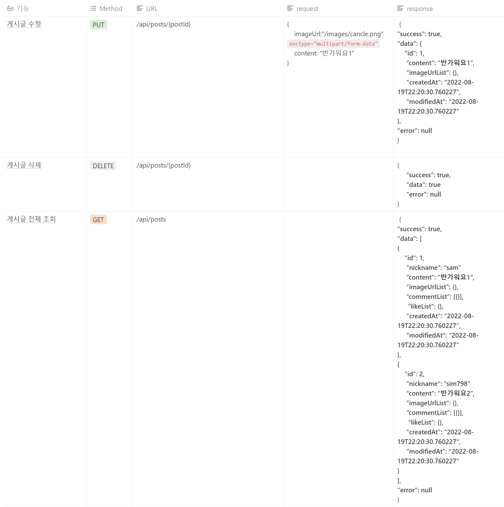
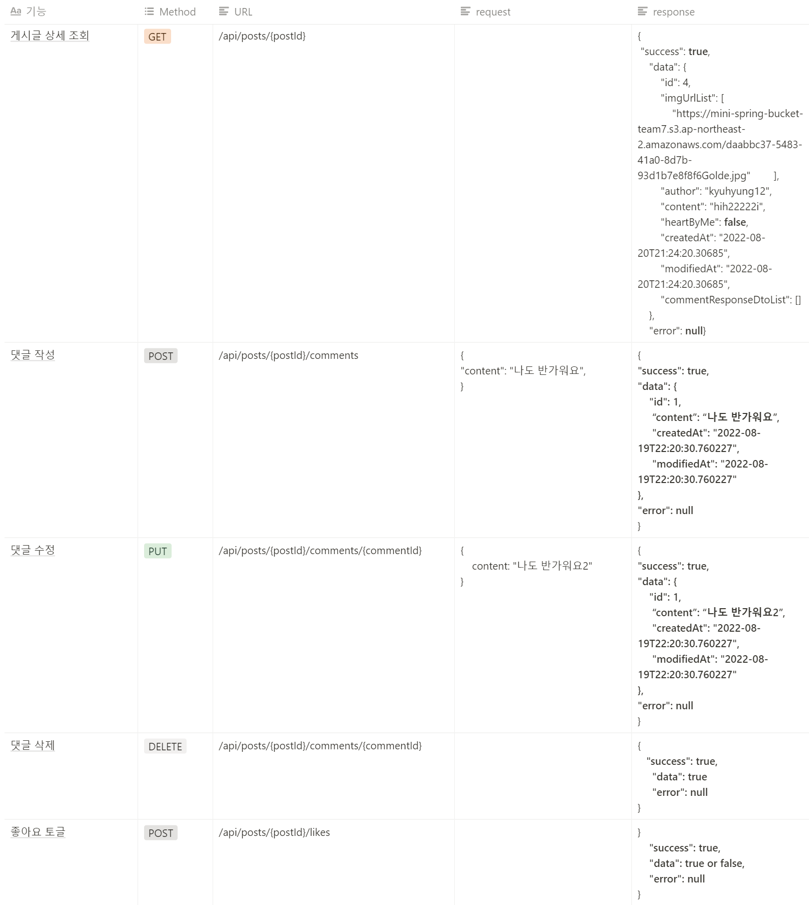
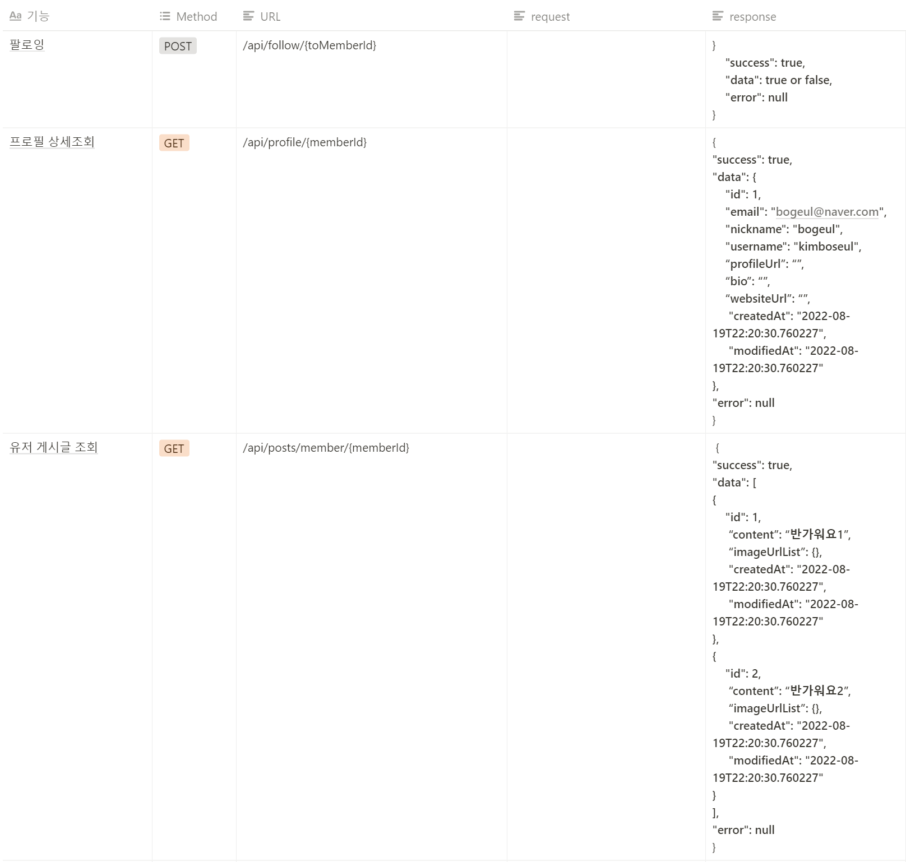
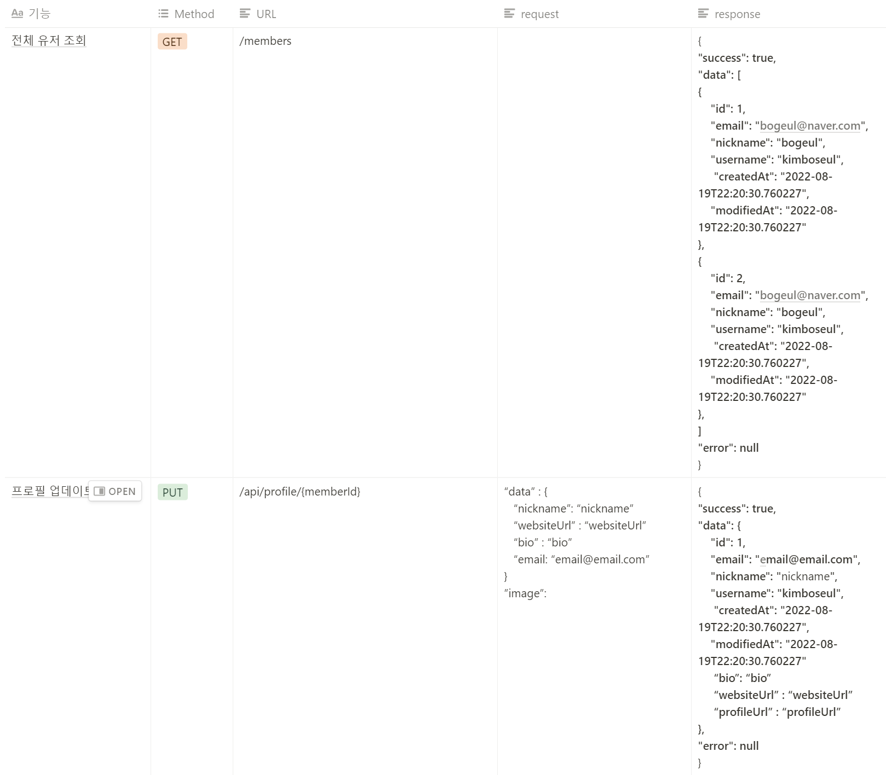
</div>
</details>

<br>
<br>

### ❗ 트러블 슈팅

#### Frontend
1. 이미지 슬라이스 컴포넌트, 모달 컴포넌트를 각각 구현해 사용
같은 페이지에서 이미지 슬라이스, 모달 컴포넌트를 사용할 때 원하는 대로 z-index 적용이 되지 않는 문제 발생

	```
	⇒ 같은 부모 태그 내부에 이미지 슬라이스, 모달이 작성되지 않아 z-index가 제대로 적용이 되지 않는 문제
	z-index가 높아도 같은 부모 태그 내부에 있지 않다면 화면 가장 앞으로 출력되지 않을 수 있음.
	```

<br>

#### Backend

1. checkPostAuthor메소드에서 post에서 가져온 member와 userdetailsimpl에서 가져온 member가 서로 다른 객체로 인식되어 equals가 안되는 현상 발생

	```
	⇒ member 도메인에 equals 메소드를 만들어 줌으로서 이 테이블에서 생성된 member와 외부에서 생성된 member를 같은 객체로 인식되게 선언
	```

2. 게시글 업로드에서 이미지를 다중이미지 업로드 시 @ElementCollection을 사용하여 imgUrlList 컬럼을 만듦
인스타그램에 글 수정 기능에 이미지를 수정할 수 없어 List<multipartFile>를 null일 postRepository에서 imgUrlList를 불러와서 그대로 넣어주는 로직으로 개발하였지만 사진이 여러장일 때 마지막 하나만 인식되는 문제가 발생

	```⇒ @ElementCollection을 사용하였기 때문에 DB에 post 테이블과 post_img_url_lis 테이블이 따로 생성됨.
	Post 도메인 클래스에 만들어뒀던 update 메소드 안에서 imgUrlList가 null이 아닐 경우에만 새로 받아와 this.imgUrlList에 넣어주는 형식으로 변경해 문제 해결
	```

<br>
